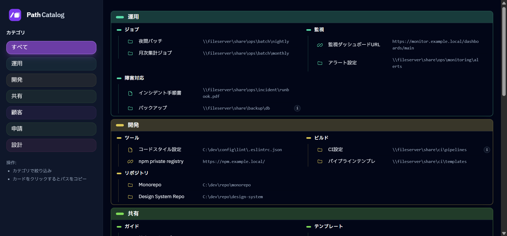

# Path Catalog

パスをカテゴリ×サブカテゴリにまとめ、ワンクリックでコピーできるシンプルなビューアです。

## 目次

- [Path Catalog](#path-catalog)
  - [目次](#目次)
  - [概要](#概要)
  - [動作環境](#動作環境)
  - [セットアップ](#セットアップ)
  - [データの編集](#データの編集)
  - [使い方](#使い方)
  - [開発メモ](#開発メモ)
  - [ライセンス](#ライセンス)

## 概要

社内パスの参照や手順共有を日常的にする人向けの、HTML+JSだけで動く軽量ビューアです。  
カテゴリ→サブカテゴリの整理で迷わず辿れ、各行をクリックするだけでパスをコピーできます。  
データ追加は `data.js` を編集するだけで即反映、カテゴリ色とカード表示でどこに何があるか一目で把握できます。

## 動作環境

- ブラウザ: 最新の Chromium / Firefox / Safari を想定
- ビルド/ランタイム: なし（静的ファイルを開くだけ）

## セットアップ

1. リポジトリを取得
2. `path-catalog.html` をブラウザで開く

## データの編集

- `data.js` 内の `window.PATH_CATALOG_DATA` を編集します。
- バックスラッシュは `const r = String.raw;` を使った ``r`\\server\share` `` 形式でそのまま記述できます。

## 使い方

- 左サイドバーでカテゴリを選択
- 右側にカテゴリ／サブカテゴリ／パスの一覧が表示
- パス行をクリックするとクリップボードにコピー
- ノートは行末の `i` にホバーで表示

## 開発メモ

- Tailwind は CDN 利用（ビルド不要）。必要に応じて手元でビルドして差し替えも可。
- アイコンやカラーリングはカテゴリ名から HSL を生成して安定化
- モバイル対応は不要な前提でレイアウト固定

## ライセンス

MIT License
