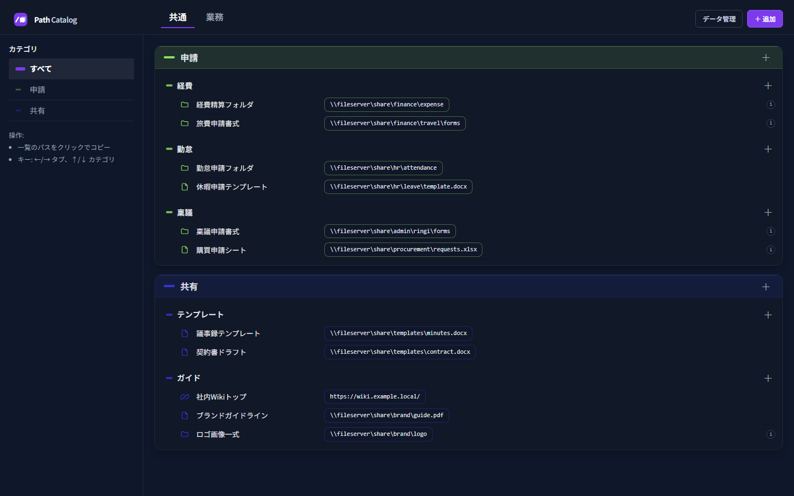

フォルダーパスやURLを整理して、クリックですぐコピー。

## 特長

- **見つけやすい** — タブ・カテゴリ・サブカテゴリで整理
- **すぐ使える** — パスをクリックするだけでコピー
- **かんたん登録** — ブラウザ上から追加・編集
- **持ち運べる** — `data.js`でバックアップ・移行

## 始め方

1. `path-catalog.html`と`data.js`を同じフォルダーに置く
2. `path-catalog.html`をブラウザで開く

インストールやサーバーは不要です。

## 使い方

- 右上の`＋ 追加`から、パス・カテゴリ・タブを追加
- カテゴリ横の`＋`から、サブカテゴリを追加
- サブカテゴリ横の`＋`から、そこへパスを追加
- `データ管理`から、`data.js`を読み込み・書き出し

追加した内容は、使用中のブラウザへ自動保存されます。

## 動作環境

最新のChrome、Edge、Firefox、Safariに対応しています。デスクトップ画面を推奨します。

## License

[MIT License](LICENSE)
