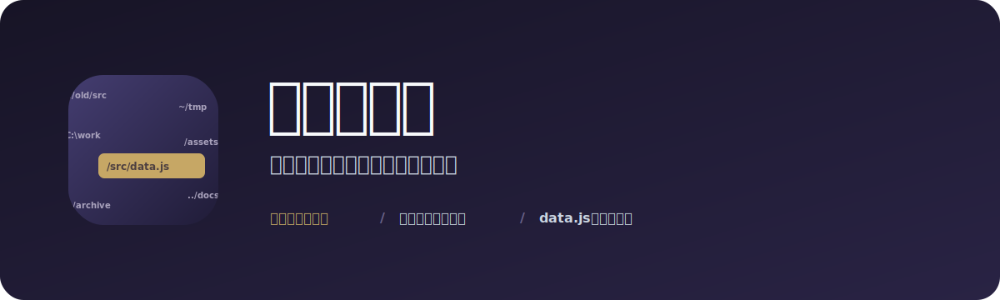
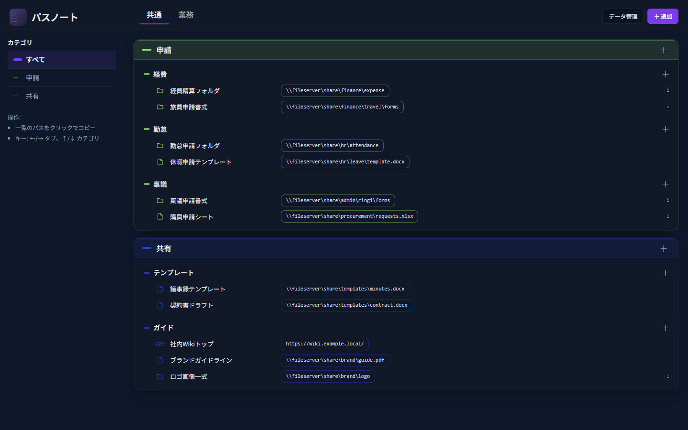

パスをまとめて、見つけやすく。

## 特長

- **見つけやすい** — タブ・カテゴリ・サブカテゴリで整理
- **すぐ使える** — パスをクリックするだけでコピー
- **かんたん登録** — ブラウザ上から追加・編集
- **表示を選べる** — スタンダード・オープン・コンパクトの3種類
- **持ち運べる** — `data.js`でバックアップ・移行

## 始め方

1. `path-note.html`と`data.js`を同じフォルダーに置く
2. `path-note.html`をブラウザで開く

インストールやサーバーは不要です。

## 使い方

- 右上の`＋ 追加`から、パス・カテゴリ・タブを追加
- カテゴリ横の`＋`から、サブカテゴリを追加
- サブカテゴリ横の`＋`から、そこへパスを追加
- `表示`から、スタンダード・オープン・コンパクトを切り替え
- `データ管理`から、`data.js`の読み込み・書き出し

追加した内容は、使用中のブラウザへ自動保存されます。

## 動作環境

最新のChrome、Edge、Firefox、Safariに対応しています。デスクトップ画面を推奨します。

## 注意事項

- 登録内容はブラウザ内に保存されます。ブラウザのデータを削除すると、登録内容も消えます。
- 大切なデータは、`データ管理`から定期的に書き出してください。
- スタイルとフォントの表示にはインターネット接続が必要です。

## 開発資料

仕組みやコードの構成を知りたい場合は、[設計資料の案内](docs/design/README.md)から読み始めてください。

## License

[MIT License](LICENSE)
