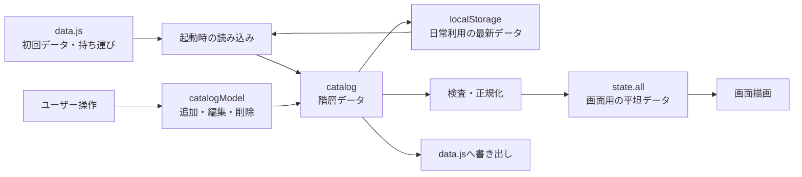
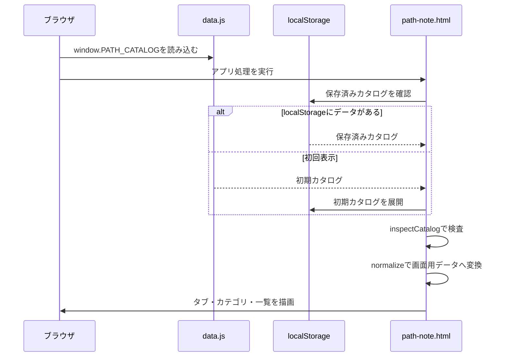
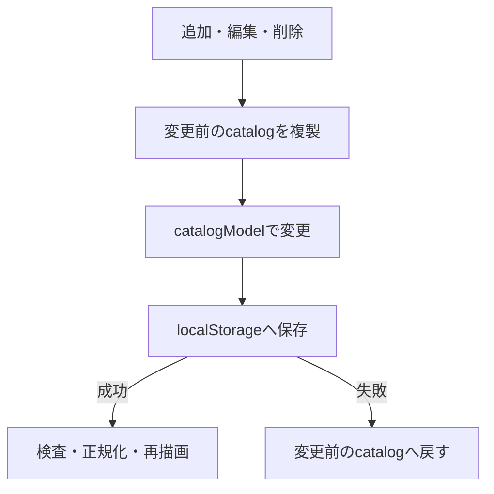
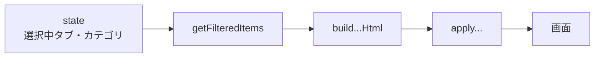

# アーキテクチャ

## 全体像

パスノートは、ブラウザだけで動作する単一ページのアプリです。ビルド処理、バックエンド、データベースはありません。



## 技術構成

| 技術 | 用途 |
| --- | --- |
| HTML | 画面構造とダイアログ |
| CSS | テーマ、表示モード、各UIの見た目 |
| Tailwind CSS CDN | レイアウトや余白などの補助クラス |
| Vanilla JavaScript | 状態管理、描画、イベント、データ操作 |
| localStorage | カタログ、表示モード、折りたたみ状態の保存 |
| `data.js` | 初期データ、インポート、エクスポート |
| GitHub Actions | 構文と必須HTML要素のスモークチェック |

フレームワークを使わないため、DOM操作と状態管理は`path-note.html`内の関数が直接担当します。

## 起動処理



起動の入口は`init`です。表示モードを適用し、イベントを登録し、初期画面と警告を描画します。

## 2種類のカタログ表現

### `catalog`: 保存・編集用の階層データ

`data.js`と同じ構造です。分類の順番と、空の分類を保持できます。

```text
タブ
└─ カテゴリ
   └─ サブカテゴリ
      └─ [表示名, パス, ノート]
```

実際には配列の入れ子で表現します。

```js
[
  ["タブ名", [
    ["カテゴリ名", [
      ["サブカテゴリ名", [
        ["表示名", "パス", "ノート"]
      ]]
    ]]
  ]]
]
```

### `state.all`: 検索・表示用の平坦データ

画面で扱いやすいよう、各パスをオブジェクトへ変換します。

```js
{
  id,
  tab,
  category,
  subCategory,
  name,
  path,
  note,
  _meta: { t, c, s, i }
}
```

`_meta`は、元の階層データ内の位置です。パスの編集・削除時に、対象の行へ戻るために使います。

## データ変更の流れ

追加・編集・削除は、直接保存せず`commitCatalogChange`を通します。



主な責務は次の通りです。

| 処理 | 役割 |
| --- | --- |
| `catalogModel` | 階層データの追加・編集・削除 |
| `commitCatalogChange` | 変更、保存、失敗時の復元 |
| `refreshCatalog` | 再検査、正規化、再描画 |
| `saveCatalog` | localStorageへ保存 |

新しいデータ変更機能を追加する場合も、この流れへ乗せます。

## 描画の流れ



描画処理は、HTML文字列を作る`build...Html`と、DOMへ反映する`apply...`に分かれています。

`renderAll`は、タブ、カテゴリ、メイン一覧をまとめて再描画します。

## データの読み込みと書き出し

### 読み込み

1. 利用者が`data.js`を選ぶ
2. `parseDataJs`が`window.PATH_CATALOG = ...;`形式だけを受け付ける
3. JSONとして解析する
4. `inspectCatalog`を厳格モードで実行する
5. 確認後、現在のカタログを置き換える

ファイル内のJavaScriptを実行して読み込む方式ではありません。

### 書き出し

1. 現在の`catalog`をJSON形式で文字列化する
2. `window.PATH_CATALOG = ...;`で包む
3. `data.js`としてダウンロードする

## 安全性の境界

| 境界 | 対応 |
| --- | --- |
| `data.js`やlocalStorageからの入力 | `inspectCatalog`で構造を検査 |
| 画面への文字列埋め込み | `toHtml`でHTMLエスケープ |
| カタログ変更失敗 | 変更前データへロールバック |
| クリップボードAPIが使えない環境 | 古いコピー方式へフォールバック |
| 不正なデータ | 警告表示、またはインポート拒否 |

## テストの範囲

GitHub Actionsのスモークチェックでは、次を確認します。

- `data.js`のJavaScript構文
- `path-note.html`内のインラインJavaScript構文
- 主要UI要素のIDが存在すること
- `data.js`がアプリ処理より先に読み込まれること
- `window.PATH_CATALOG`が配列であること

画面操作や見た目の自動テストは現在ありません。UI変更時はブラウザでの確認も必要です。
